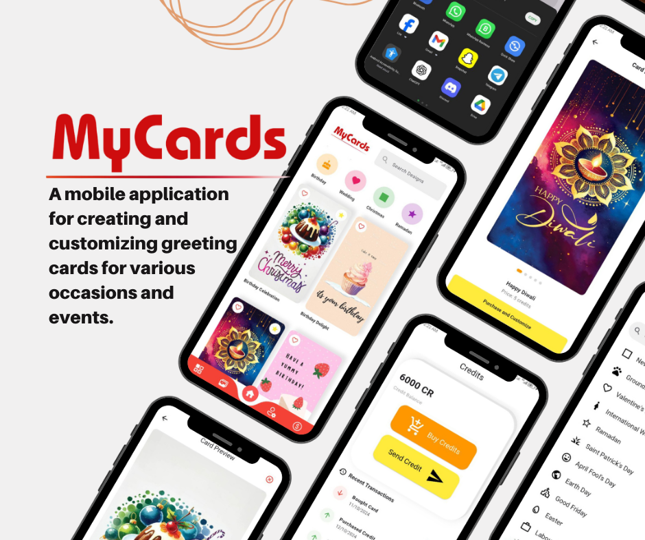
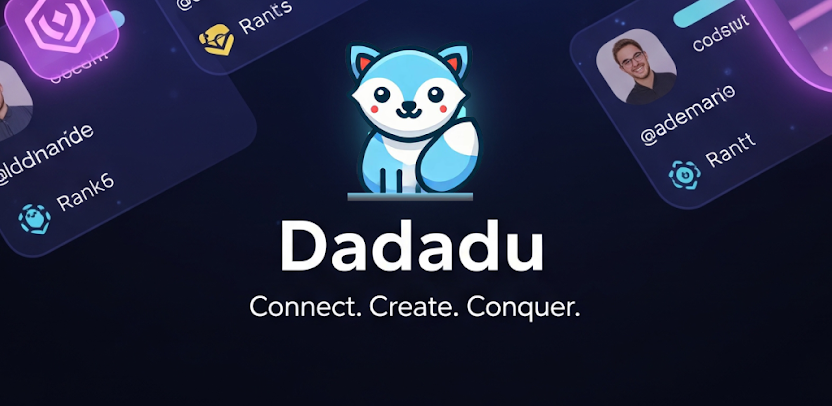
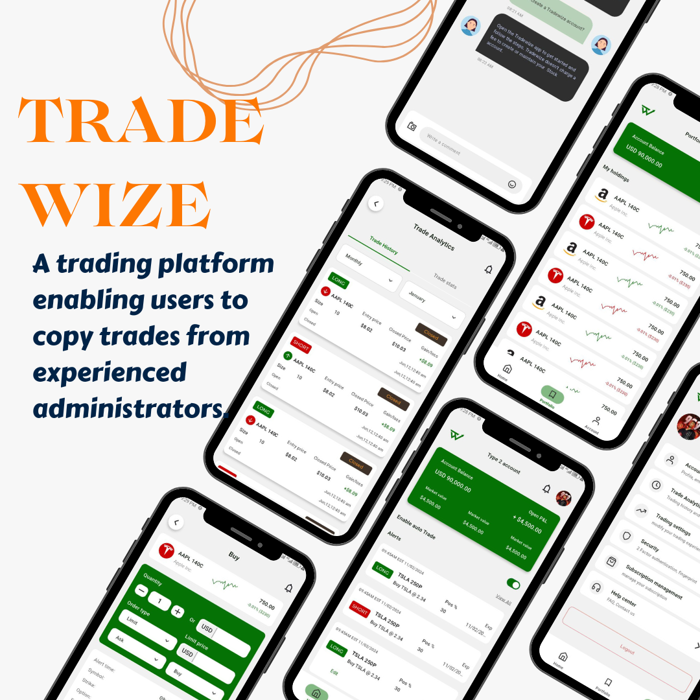
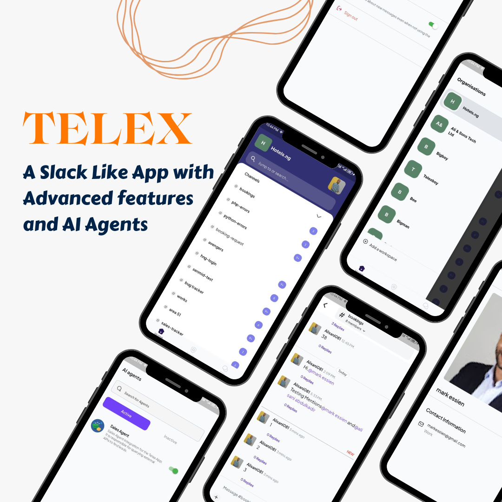
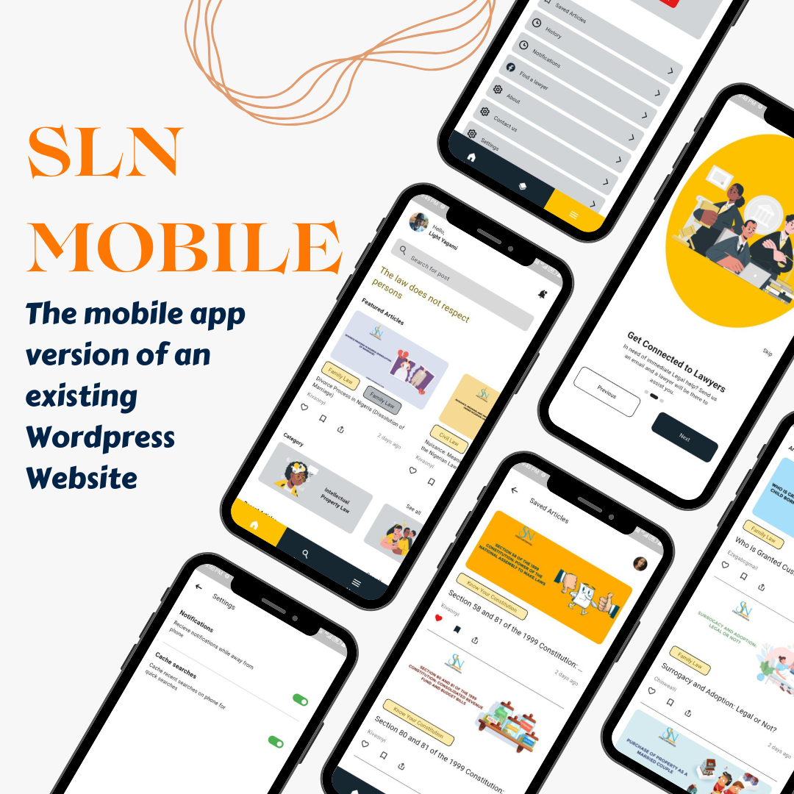
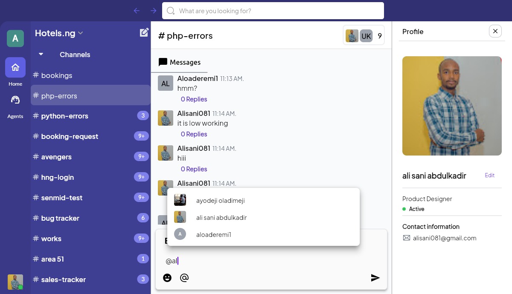
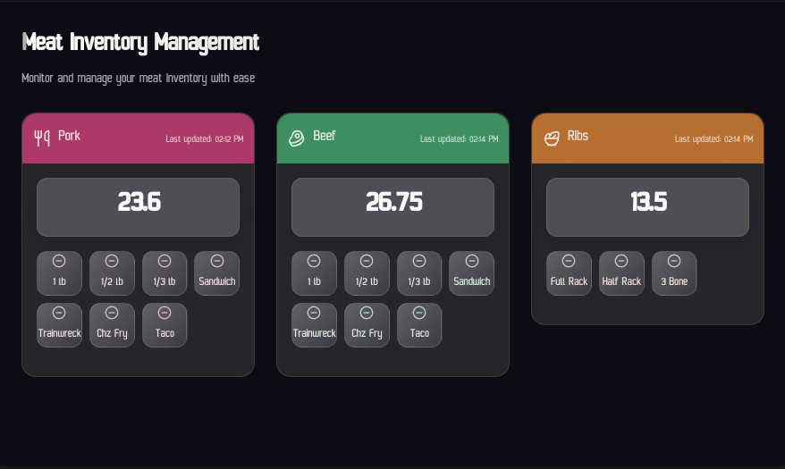

# 💫 About Me:
👋 Hi, I build scalable cross-platform mobile app solutions.
- Got that app idea, I'll build it.
- Bring That broken app, i'll fix it.
- I'm the developer that other developers trust when they need things done well and quickly.

I build high-quality mobile apps that are:
- Smooth and bug-free
- Packed with the features you need
- Responsive
- Integrated with modern technologies (APIs, payment gateways, Firebase, Riverpod, AI ) - you name it

## 💻 Tech Stack
 
 
 

 
 

## 🌐 Connect With Me
 
 
 

## 🚀 Featured Projects

---

### MyCards
A mobile application for creating and customizing greeting cards for various occasions and events.
- **Role**: Solo Developer & Designer
- **Technologies**: Flutter, Firebase, Riverpod
- **Features**: Custom card creation, template editing and card sharing

#### Preview

📱 [Watch Video Demo](https://drive.google.com/file/d/1-fGRbpvS_025r4K4fFJX4D0ddITfnPRI)

 

---

### Dadadu
A fast-growing social video platform where authentic moments and creativity take center stage.
- **Features**: In-app video recording/editing, Universal search, Gamified ranking system (Leaf to Dadalord), Real-time engagement.
- **Technologies**: Flutter, FFMPEG, Supabase, Social Graph.

#### Preview

 

---

### Tranzt Logistics Vendor App
A specialized vendor application part of a logistics ecosystem.
- **Features**: Pixel-perfect UI implementation, seamless order management.
- **Ecosystem**: Part of a 3-app suite (Vendor, User, Rider).

#### Preview

---

### MyElectrician
A dual-role mobile app connecting clients with nearby electricians using real-time location matching.
- **Features**: Google Maps proximity discovery, Stripe payment gateway, Real-time chat.
- **Technologies**: Flutter, Google Maps API, Stripe, Firebase.

#### Preview

---

### 9ja Markets
Discover and Connect with Nigeria’s Major Markets.
- **Features**: Browse local markets, connect with verified vendors, chat and negotiate, product promotion.
- **Technologies**: Flutter, Real-time Messaging.

#### Preview

---

### Housify
A direct housing marketplace connecting landlords with tenants.
- **Role**: Lead Developer
- **Technologies**: Flutter, Firebase, Payment Gateway Integration
- **Features**: Verified listings, escrow payments, rental management
- **Technical**: Location-based search, document verification, secure payments

#### Preview

📱 [Watch Video Demo](https://drive.google.com/file/d/15GNYJxd6kd3RhKSmTOfPv5zYvYkMX7Xp)

---

### Republic Club System
A suite of internal mobile applications for tailored operational workflows and club management.
- **Apps**: Service Scanning, TV Monitoring, Staff Service, and Admin Apps.
- **Features**: Role-based access control, multi-tenant Club Connect system, real-time service visibility.
- **Technologies**: Flutter, Custom Backend.

#### Preview

---

### Trade Wize
A sophisticated trading platform enabling users to copy trades from top traders in real-time.
- **Features**: Multi-tier account management, In-app subscription system, Automated trading mechanisms, Deep linking.
- **Technical**: Web-based admin dashboard, custom trading algorithms.

#### Preview

📱 [Watch Video Demo](https://drive.google.com/file/d/1-ePBj0OWzARp6LuyWaR9gI8kHbqDJxAn)

---

### Telex Mobile
A fast and secure Slack like chat app designed for teams, featuring real-time messaging, AI agents, seamless collaboration and so much more...
- **Role**: Mobile Developer (Team Member)
- **Technologies**: Flutter, Firebase, Riverpod
- **Features**: Real-time messaging,file sharing, team collaboration, AI agents etc
- **Technical**: WebSocket integration, push notifications, message encryption, AI integration etc

#### Preview

---

### SLN Mobile
The mobile version of [Street Lawyer Naija](https://streetlawyernaija.com).
- **Role**: Mobile Developer (Team Member)
- **Contribution**: Collaborated on WordPress API integration and mobile app development
- **Achievement**: Successfully translated web functionality to mobile platform

#### Preview

📱 [Watch Video Demo](https://drive.google.com/file/d/15D8v0b4LUybhw-5RtcH-wMS1Fil2WegI)

---

### Telex Desktop
The desktop companion for Telex, bringing all the power of team communication to a larger screen.
- **Role**: Desktop Developer (Team Member)
- **Technologies**: Flutter Desktop, Firebase
- **Features**: Enhanced productivity tools, screen sharing, keyboard shortcuts
- **Technical**: Cross-platform compatibility, native OS integration

#### Preview

---

### Trade Wize Admin
Web administration panel for the Trade Wize platform.
- **Features**: Trade management, user subscription oversight, automated trade execution
- **Technologies**: Web technologies, real-time updates

#### Preview

---

### Meat Inventory App
A smart inventory management app for meat vendors, revolutionizing stock control and sales tracking.
- **Role**: Full-stack Developer
- **Technologies**: Flutter, Firebase, Cloud Functions
- **Features**: Real-time inventory tracking, sales analytics, supplier management
- **Technical**: Automated low stock alerts.

#### Preview

---

> Note: Most of the applications listed above are client projects, hence only video demonstrations are available.

Feel free to explore my repositories for personal projects. Currently working on a billion dollar app idea that could be the next big thing in mobile applications - don't be surprised when you see me as CEO and Founder. Stay tuned! 🚀

