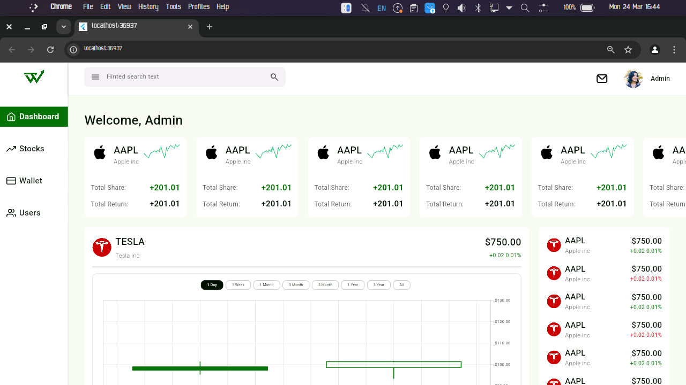

# 💫 About Me:
👋 Hi, I'm Emmanuel, the Mastermind and I build mobile app solutions with flutter.
- Bring that app idea, I'll fix it.
- Bring That broken app, i'll fix it.
- I'm the developer that other developers trust when they need things done well and quickly.

I build high-quality mobile apps that are:
- Smooth and bug-free
- Packed with the features you need
- Responsive
- Integrated with modern technologies (APIs, payment gateways, Firebase, Riverpod, AI )- you name it

## 💻 Tech Stack
 
 
 
 
 

## 🌐 Connect With Me
 
 
 

## 🚀 Featured Projects

---

### Housify
A direct housing marketplace connecting landlords with tenants.
- **Role**: Lead Developer
- **Technologies**: Flutter, Firebase, Payment Gateway Integration
- **Features**: Verified listings, escrow payments, rental management
- **Technical**: Location-based search, document verification, secure payments

#### Preview

📱 [Watch Video Demo](Housify.mp4)

---

### Trade Wize
A sophisticated trading platform enabling users to copy trades from experienced administrators.
- **Features**: Multi-tier accounts, in-app subscriptions, auto trading, alert notifications, deep links
- **Technical**: Custom API integration, complex data management

#### Preview

📱 [Watch Video Demo](tradewizeapp.mp4)

---

### Telex Mobile
A fast and secure Slack like chat app designed for teams, featuring real-time messaging, AI agents, seamless collaboration and so much more...
- **Role**: Mobile Developer (Team Member)
- **Technologies**: Flutter, Firebase, Riverpod
- **Features**: Real-time messaging,file sharing, team collaboration, AI agents etc
- **Technical**: WebSocket integration, push notifications, message encryption, AI integration etc

#### Preview

---

### SLN Mobile
The mobile version of [Street Lawyer Naija](https://streetlawyernaija.com).
- **Role**: Mobile Developer (Team Member)
- **Contribution**: Collaborated on WordPress API integration and mobile app development
- **Achievement**: Successfully translated web functionality to mobile platform

#### Preview

📱 [Watch Video Demo](SLNMobile.mp4)

---

### Telex Desktop
The desktop companion for Telex, bringing all the power of team communication to a larger screen.
- **Role**: Desktop Developer (Team Member)
- **Technologies**: Flutter Desktop, Firebase
- **Features**: Enhanced productivity tools, screen sharing, keyboard shortcuts
- **Technical**: Cross-platform compatibility, native OS integration

#### Preview

---

### Trade Wize Admin
Web administration panel for the Trade Wize platform.
- **Features**: Trade management, user subscription oversight, automated trade execution
- **Technologies**: Web technologies, real-time updates

#### Preview

---

### Meat Inventory App
A smart inventory management app for meat vendors, revolutionizing stock control and sales tracking.
- **Role**: Full-stack Developer
- **Technologies**: Flutter, Firebase, Cloud Functions
- **Features**: Real-time inventory tracking, sales analytics, supplier management
- **Technical**: Automated low stock alerts.

#### Preview

---

> Note: Most of the applications listed above are client projects, hence only video demonstrations are available.

Feel free to explore my repositories for personal projects. Currently working on a billion dollar app idea that could be the next big thing in mobile applications - don't be surprised when you see me as CEO and Founder. Stay tuned! 🚀

